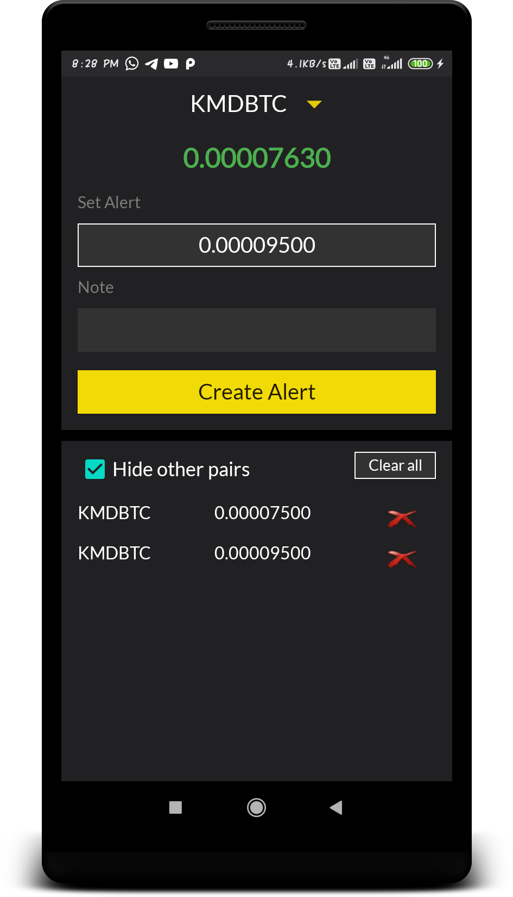
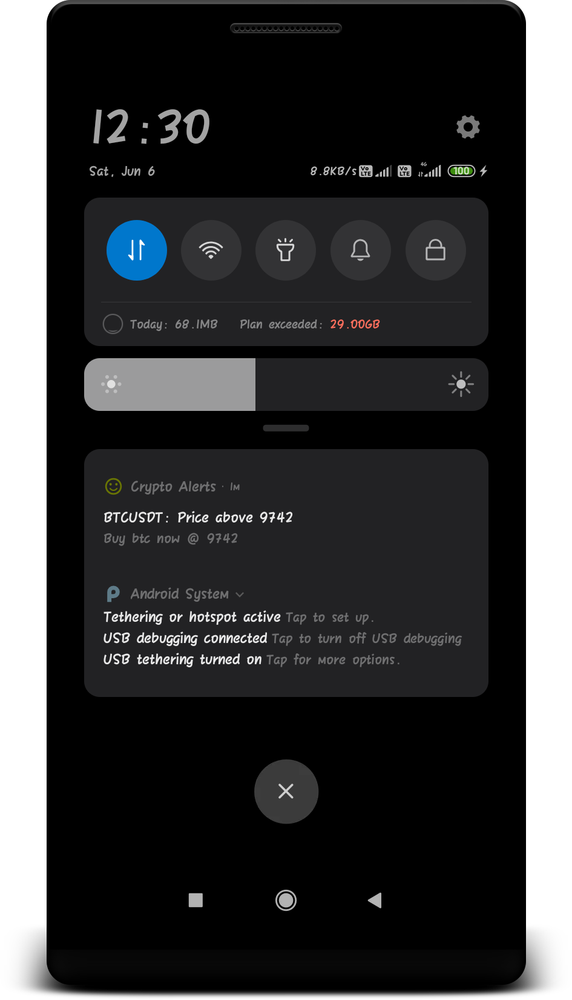
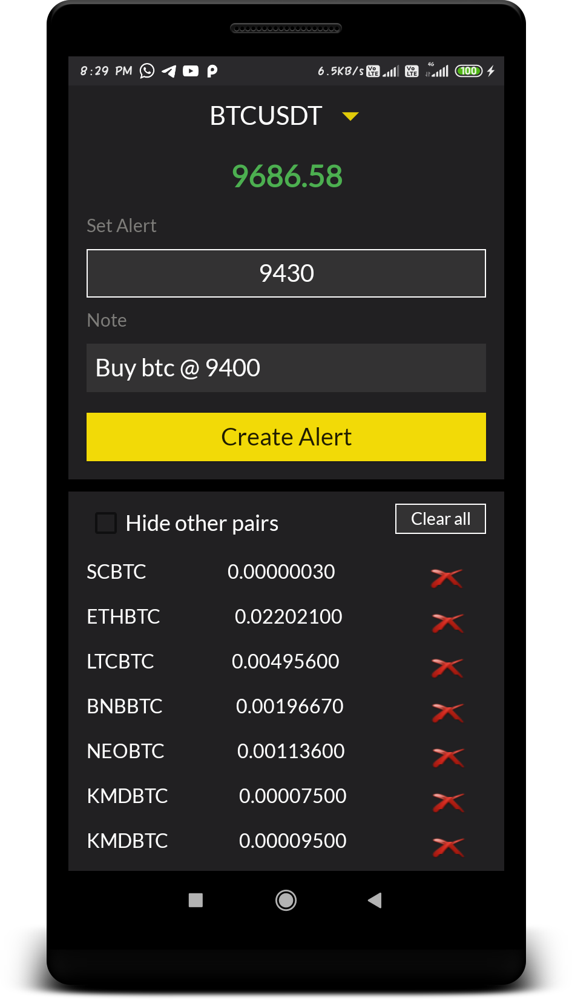

# CryptoAlerts
### CryptoAlerts is made to get instant alerts for over 800+ cryptocurrency pairs from Binance. You can add your custom note with alerts, and track realtime prices of multiple coins. 

#### Features:
- Track realtime Prices
- Add alerts
- Add custom note with alerts
- Amazing performance with device DataBase
- 800+ crypto Pairs

#### I have used:
- Rest API
- Volley library
- Recycler View
- SQLite DataBase
- Threads
- Android Services
- Notifications

#### Upcoming Feature : Wallet maintenance :+1:

#### Screenshots: 

Hide other Pairs             |  Alert notification
:-------------------------:|:-------------------------:
  |  

  | 
